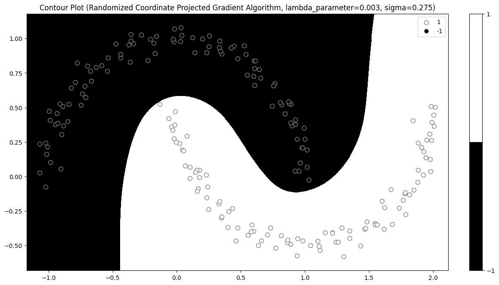
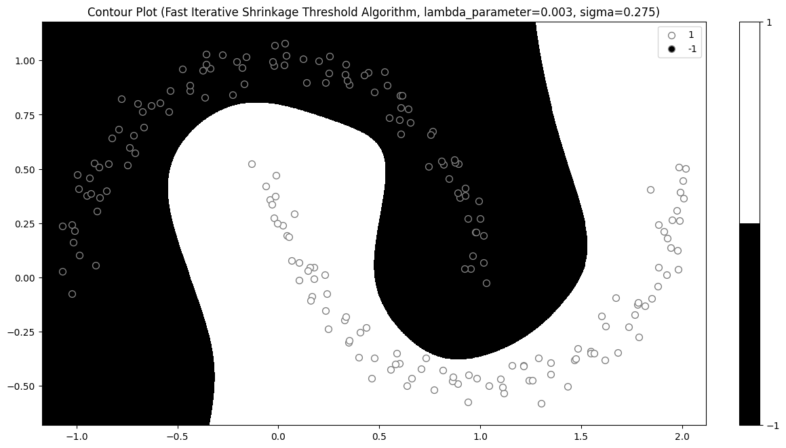
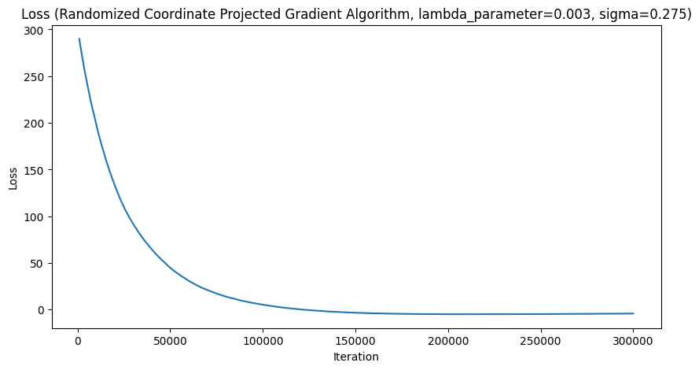
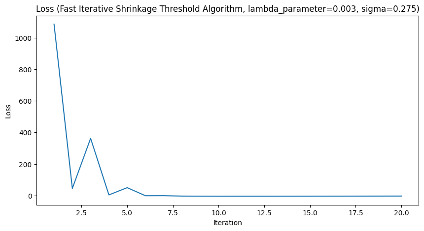

# Convex Optimisation

Convex Optimisation coursework for Advanced Topics in Machine Learning (COMP0083) at UCL 2022

- Proximal Stochastic Gradient Algorithm (PSGA)
- Randomised Coordinate Proximal Gradient Algorithm (RCPGA)
- Fast Iterative Shrinkage Threshold Algorithm (FISTA)

To set up your python environment:

1. Install `poetry`

```shell
pip install poetry
```

2. Install dependencies

```shell
poetry install
```

## Recovering Sparse Features with LASSO:
<p align="center">
  
  
</p>
<p align="center">
  <em>Sparse Features from LASSO vs Actual Sparse Feature Vector</em>
</p>

## Support Vector Machine Decision Boundary with Dual Formulation:
<p align="center">
  
  
</p>
<p align="center">
  <em>Contour Plots for Half Moon's Problem</em>
</p>

<p align="center">
  
  
</p>
<p align="center">
  <em>Objective functions for RCPGA and FISTA</em>
</p>